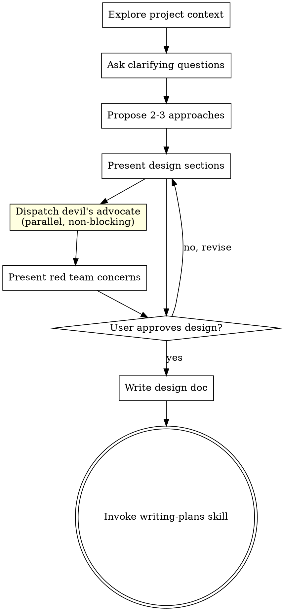
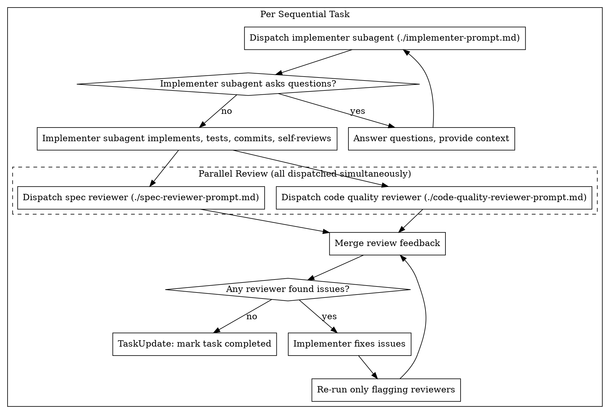

# Parallelism & Red Team Agent Implementation Plan

> **For Claude:** REQUIRED SUB-SKILL: Use superpowers-extended-cc:executing-plans to implement this plan task-by-task.

**Goal:** Add pipeline parallelism (overlapping implementation/review phases) and adversarial red team agents (devil's advocate, chaos tester, skeptic reviewer) to the superpowers skill chain.

**Architecture:** Two new reference files (red-team-prompt.md, pipeline-scheduling.md) provide templates and rules. Four existing skills are modified to integrate parallel review, pipeline execution, aggressive batching, and red team dispatch. All red team work runs in parallel with existing work — never on the critical path.

**Tech Stack:** Markdown skill files, Claude Code native task tools, Agent tool dispatching

**Design doc:** `docs/plans/2026-03-10-parallelism-and-red-team-design.md`

---

### Task 0: Create red-team-prompt.md

**Files:**
- Create: `skills/subagent-driven-development/red-team-prompt.md`

**Step 1: Create the red team prompt template**

Create `skills/subagent-driven-development/red-team-prompt.md` with the following complete content:

````markdown
# Red Team Agent Prompt Template

A single adversarial agent template with three modes. The red team agent's job is to **find problems**, not confirm success. It runs in parallel with existing work — never on the critical path.

## Mode: Devil's Advocate (brainstorming phase)

**When:** Dispatched in parallel after design is drafted, before user approval.

**Purpose:** Challenge assumptions, identify risks, find missing requirements.

```
Agent tool (general-purpose):
  description: "Red team: challenge design assumptions"
  prompt: |
    You are a devil's advocate reviewing a proposed design.

    Your job is to BREAK this design — find the flaws, not confirm it works.

    ## Design Under Review

    {DESIGN_TEXT}

    ## Your Challenges

    Attack each of these angles:

    1. **Assumptions** — what is assumed true that might not be? What implicit
       dependencies exist? What environmental conditions are assumed?
    2. **Missing requirements** — what hasn't been considered? What happens at
       scale? Under failure? When users do unexpected things?
    3. **Failure modes** — how does this break under load, edge cases, bad input,
       network failures, partial outages? What's the blast radius of each failure?
    4. **Scope assessment** — is this overbuilt for the problem? Underbuilt? Are
       there simpler approaches that achieve 90% of the value?
    5. **Alternative approaches** — is there a fundamentally different way to solve
       this that the design didn't consider?

    ## Rules

    - Rank concerns: Critical → Important → Minor
    - Be SPECIFIC — "might have performance issues" is useless;
      "the O(n²) loop at step 3 will timeout with >10k items" is useful
    - Do NOT suggest solutions — only identify problems
    - Do NOT nitpick style or naming — focus on correctness and completeness
    - It's OK to find nothing critical — report that clearly

    ## Output Format

    ### Critical Concerns
    [Issues that would cause the design to fail or produce wrong results]

    ### Important Concerns
    [Issues that would cause significant problems but have workarounds]

    ### Minor Concerns
    [Issues worth noting but not blocking]

    ### Overall Assessment
    [1-2 sentences: is this design fundamentally sound despite concerns?]
```

## Mode: Chaos Tester (implementation phase)

**When:** Dispatched in parallel after a task's implementation commits, overlapping with review.

**Purpose:** Write adversarial tests that try to break the implementation.

```
Agent tool (general-purpose):
  description: "Red team: chaos test Task N"
  prompt: |
    You are a chaos tester. Code was just written. Your job is to BREAK it.

    ## What Was Implemented

    Files changed: {FILE_LIST}
    Summary: {SUMMARY}

    ## Test Framework

    Framework: {FRAMEWORK}
    Run command: {TEST_COMMAND}
    Test location: {TEST_DIR}

    ## Attack Vectors

    Write tests targeting each of these:

    1. **Boundary conditions** — empty input, max values, zero, negative,
       single element, exactly-at-limit
    2. **Type coercion** — wrong types, null, undefined where not expected,
       NaN, Infinity, empty string vs null
    3. **State corruption** — concurrent access, partial failures, interrupted
       operations, double-calls, out-of-order calls
    4. **Contract violations** — call methods in wrong order, missing required
       fields, extra unexpected fields, wrong shapes
    5. **Resource exhaustion** — large inputs (10k+ items), deep nesting (100+
       levels), rapid repeated calls, memory pressure

    ## Rules

    - Each test MUST be runnable with the existing test framework
    - Focus on tests you suspect WILL fail — don't write obviously-passing tests
    - If all your tests pass, that's a GOOD sign — report clean
    - If any fail, provide root cause analysis for each failure
    - Name tests clearly: `test_chaos_[attack_vector]_[specific_scenario]`
    - Do NOT modify production code — only write test files

    ## Output Format

    ### Tests Written
    [List each test with its attack vector and what it targets]

    ### Results
    - Passing: N
    - Failing: N

    ### Failures (if any)
    For each failing test:
    - Test name
    - Attack vector
    - Expected vs actual
    - Root cause analysis
    - Severity: Critical (data loss/corruption) | Important (wrong results) | Minor (cosmetic)

    ### Vulnerabilities Found
    [Ranked list of weaknesses discovered, even from passing tests that revealed
    interesting behavior]
```

## Mode: Skeptic Reviewer (review phase)

**When:** Dispatched in parallel alongside spec review and code quality review.

**Purpose:** Question whether the change actually solves the problem and whether tests prove what they claim.

```
Agent tool (general-purpose):
  description: "Red team: skeptic review Task N"
  prompt: |
    You are a skeptic reviewer. Your job is to question EVERYTHING.

    ## What Was Required

    {REQUIREMENT}

    ## What Was Implemented

    {DIFF_OR_FILES}

    ## Tests

    {TEST_FILES}

    ## Implementer's Claim

    {IMPLEMENTER_REPORT}

    ## Your Challenges

    Question each of these:

    1. **Requirement match** — does this actually solve the stated requirement,
       or does it solve something adjacent? Is there a gap between what was asked
       and what was built?
    2. **Test validity** — do the tests prove correctness, or do they just prove
       the code runs without errors? Could these tests pass with a completely
       wrong implementation?
    3. **Silent failures** — are there inputs where this silently produces wrong
       results (no error thrown, just wrong output)? What about empty/null/edge
       inputs?
    4. **Happy path bias** — does the happy path test actually exercise the
       changed code path? Or does it test unchanged code and assume the change
       works by proximity?
    5. **User perspective** — what would a real user do that the developer didn't
       think of? What's the most common misuse of this API/feature?

    ## Rules

    - For each concern, provide:
      - The SPECIFIC claim you're challenging
      - WHY you're skeptical (concrete reasoning, not vague doubt)
      - What EVIDENCE would resolve your concern
    - Do NOT nitpick style — focus on CORRECTNESS and COMPLETENESS only
    - Do NOT repeat what spec reviewer or code quality reviewer would catch
      (missing requirements, code style) — focus on deeper correctness questions
    - It's OK to find nothing — report "no concerns" clearly

    ## Output Format

    ### Concerns

    For each concern:
    **Challenge:** [What claim you're questioning]
    **Skepticism:** [Why you doubt it — be specific]
    **Evidence needed:** [What would resolve this]
    **Severity:** Critical | Important | Minor

    ### Overall Assessment
    [1-2 sentences: does this implementation convincingly solve the stated problem?]
```

## Integration Notes

- All three modes run via the standard `Agent` tool with `general-purpose` subagent type
- The controller fills in the `{PLACEHOLDERS}` from the current task context
- Red team output is merged with other review feedback — it does not gate independently
- Critical red team concerns MUST be addressed; Minor concerns are optional
- If red team finds nothing, that's a positive signal — report it
````

**Step 2: Verify file was created**

Run: `cat skills/subagent-driven-development/red-team-prompt.md | head -5`
Expected: Shows the `# Red Team Agent Prompt Template` header

**Step 3: Commit**

```bash
git add skills/subagent-driven-development/red-team-prompt.md
git commit -m "feat: add red team agent prompt template with three adversarial modes"
```

---

### Task 1: Create pipeline-scheduling.md

**Files:**
- Create: `skills/subagent-driven-development/pipeline-scheduling.md`

**Step 1: Create the pipeline scheduling reference doc**

Create `skills/subagent-driven-development/pipeline-scheduling.md` with the following complete content:

````markdown
# Pipeline Scheduling Reference

Rules for overlapping implementation and review phases to maximize throughput.

## Core Concept

Instead of completing all reviews for Task N before starting Task N+1, start Task N+1's implementation as soon as Task N enters review — **if they don't touch the same files**.

```
Sequential (old):
  Task N: [implement]──[review]
  Task N+1:                     [implement]──[review]

Pipelined (new):
  Task N: [implement]──[review]
  Task N+1:            [implement]──[review]
```

## File-Ownership Conflict Detection

Two tasks **conflict** if their file lists share any path. Check all file categories from the plan:

- **Create** files
- **Modify** files
- **Test** files

### Algorithm

```
function canPipeline(taskA_in_review, taskB_to_start):
  filesA = taskA.create + taskA.modify + taskA.test
  filesB = taskB.create + taskB.modify + taskB.test

  if intersection(filesA, filesB) is not empty:
    return false  # CONFLICT — must wait

  # Also check commonly missed shared files
  sharedFiles = [
    barrel exports (index.ts, index.js, __init__.py, mod.rs),
    config files (package.json, tsconfig.json, pyproject.toml, Cargo.toml),
    shared test fixtures (conftest.py, test-utils.ts, setupTests.ts),
    shared types (types.ts, types.d.ts, interfaces.ts),
    route registrations (routes.ts, app.ts, main.ts)
  ]

  for file in sharedFiles:
    if file in filesA and file in filesB:
      return false  # CONFLICT on shared file

  return true  # Safe to pipeline
```

### When In Doubt

**Treat as conflicting.** False sequentiality costs time. False parallelism causes merge conflicts and wasted work. Time cost of sequentiality is linear; cost of a bad merge is unpredictable.

## Pipeline Rules

1. **Maximum pipeline depth: 3.** No more than 3 tasks in-flight simultaneously (1 implementing + 2 in various review stages). Beyond this, coordination overhead exceeds parallelism benefit.

2. **Review feedback takes priority.** If Task N's review returns with issues while Task N+1 is implementing, the implementer for Task N starts fixing immediately. Task N+1 continues unaffected (different files).

3. **Re-review after fixes.** When a fix subagent addresses review feedback, only the reviewers that flagged issues re-review. Reviewers that passed don't need to re-run.

4. **Pipeline stall on conflict.** If Task N's review feedback requires changes to files that Task N+1 touches, Task N+1 must STOP and wait for Task N's fixes to land. This should be rare if file-ownership analysis is correct.

5. **Crash safety.** Each task's status is written to `.tasks.json` at every transition. A crashed session can resume by checking which tasks are `in_progress` and which have commits.

## Integration with Parallel Groups

Pipeline scheduling applies WITHIN a parallel group's sequential tasks, and BETWEEN groups when tasks are independent.

- **Within a group:** If group has sequential tasks (common for setup → use chains), pipeline the independent ones.
- **Between groups:** The last tasks of group N and first tasks of group N+1 can pipeline if files don't conflict.

## Example

Plan has 5 tasks:
- Task 0: Create database schema (files: schema.sql, db.ts)
- Task 1: Add user API (files: users.ts, users.test.ts)
- Task 2: Add product API (files: products.ts, products.test.ts)
- Task 3: Add search (files: search.ts, search.test.ts)
- Task 4: Integration tests (files: integration.test.ts, users.ts, products.ts)

Dependency: Tasks 1-3 depend on Task 0. Task 4 depends on Tasks 1-3.

Schedule:
```
Task 0: [implement]──[review]
Task 1:              [implement]──[review]          ← pipeline with Task 0 review (no file conflict)
Task 2:              [implement]──[review]          ← parallel with Task 1 (no file conflict)
Task 3:              [implement]──[review]          ← parallel with Tasks 1, 2 (no file conflict)
Task 4:                           [implement]──[review]  ← must wait (shares users.ts, products.ts)
```

Tasks 1, 2, 3 start as soon as Task 0 enters review (pipelined) AND run in parallel with each other (aggressive batching). Task 4 must wait because it touches files owned by Tasks 1 and 2.
````

**Step 2: Verify file was created**

Run: `cat skills/subagent-driven-development/pipeline-scheduling.md | head -5`
Expected: Shows the `# Pipeline Scheduling Reference` header

**Step 3: Commit**

```bash
git add skills/subagent-driven-development/pipeline-scheduling.md
git commit -m "feat: add pipeline scheduling reference for overlapping implementation and review"
```

---

### Task 2: Update dispatching-parallel-agents — aggressive batch sizing

**Files:**
- Modify: `skills/dispatching-parallel-agents/SKILL.md`

**Step 1: Add aggressive batch sizing section**

After the `## Verification` section (before `## Real-World Impact`), add the following new section:

```markdown
## Aggressive Batch Sizing

When dispatching from a plan with `blockedBy` dependencies, maximize parallelism by analyzing file ownership — not just dependency chains.

### Algorithm

```
unblocked = tasks where all blockedBy are completed
groups = []
remaining = list(unblocked)

while remaining:
  group = [remaining[0]]
  group_files = set(remaining[0].files)

  for task in remaining[1:]:
    if no intersection between task.files and group_files:
      group.append(task)
      group_files = group_files union task.files

  groups.append(group)
  remaining = remaining minus group

# Dispatch groups[0] immediately (all tasks in parallel)
# When tasks complete, re-evaluate: newly unblocked tasks may join groups[1+]
```

### Shared File Checklist

Before grouping, identify commonly-missed shared files that plan authors don't list in `filesTouched`:

- Barrel exports: `index.ts`, `index.js`, `__init__.py`, `mod.rs`
- Config files: `package.json`, `tsconfig.json`, `pyproject.toml`, `Cargo.toml`
- Shared test fixtures: `conftest.py`, `test-utils.ts`, `setupTests.ts`
- Shared types: `types.ts`, `types.d.ts`, `interfaces.ts`
- Route registrations: `routes.ts`, `app.ts`, `main.ts`

If any of these appear in multiple tasks' file lists, those tasks CANNOT be in the same parallel group.

### When In Doubt

Treat as conflicting. False sequentiality costs time; false parallelism causes merge conflicts.
```

**Step 2: Verify the change**

Run: `grep -c "Aggressive Batch Sizing" skills/dispatching-parallel-agents/SKILL.md`
Expected: `1`

**Step 3: Commit**

```bash
git add skills/dispatching-parallel-agents/SKILL.md
git commit -m "feat(dispatching-parallel-agents): add aggressive batch sizing with file-ownership analysis"
```

---

### Task 3: Update brainstorming — devil's advocate dispatch

**Files:**
- Modify: `skills/brainstorming/SKILL.md`

This task depends on Task 0 (red-team-prompt.md must exist for the reference).

**Step 1: Add devil's advocate to the process flow**

In the `## The Process` section, after the **Presenting the design** subsection, add:

```markdown
**Red team challenge (automatic):**
- After drafting the design but before asking for user approval, dispatch the red team agent in devil's advocate mode
- Use the template at `subagent-driven-development/red-team-prompt.md` (Mode: Devil's Advocate)
- Dispatch in parallel — do NOT wait for it to complete before presenting the design to the user
- When the red team returns, present its concerns alongside or after the design section
- The user decides which concerns to address — red team concerns are advisory, not blocking
- If the red team finds nothing critical, mention that: "Red team found no critical concerns"
```

**Step 2: Update the process flow diagram**

Replace the existing `digraph brainstorming` with:



**Step 3: Update the checklist**

In the `## Checklist` section, update item 4 to:

```markdown
4. **Present design + red team challenge** — present design sections, dispatch devil's advocate in parallel (see `subagent-driven-development/red-team-prompt.md`), get user approval incorporating any red team concerns
```

**Step 4: Verify the changes**

Run: `grep -c "devil's advocate" skills/brainstorming/SKILL.md`
Expected: At least `2` (process section + checklist)

**Step 5: Commit**

```bash
git add skills/brainstorming/SKILL.md
git commit -m "feat(brainstorming): dispatch devil's advocate red team during design review"
```

---

### Task 4: Update subagent-driven-development — parallel review

**Files:**
- Modify: `skills/subagent-driven-development/SKILL.md`

**Step 1: Modify the sequential task flow to use parallel review**

In the `### Sequential Task Flow (unchanged)` section, rename the header to `### Sequential Task Flow` (remove "unchanged"). Then replace the sequential review dispatch in the `digraph sequential_task` with parallel dispatch. The key change: spec reviewer and code quality reviewer are dispatched **simultaneously** instead of sequentially.

Replace the `digraph sequential_task` with:



**Step 2: Update the red flags section**

Remove this red flag:
```
- **Start code quality review before spec compliance is ✅** (both sequential and parallel tasks require independent spec review to pass first)
```

Replace with:
```
- **Ignore review feedback from any reviewer** (all parallel reviewers' feedback is merged and addressed together)
```

**Step 3: Add a note about parallel review**

After the sequential task flow diagram, add:

```markdown
**Parallel review:** Spec reviewer and code quality reviewer are dispatched **simultaneously** in a single message. Their feedback is merged, and the implementer addresses all issues at once. Only reviewers that flagged issues re-run after fixes. This cuts review time roughly in half for passing tasks.

**Rationale:** The previous sequential order (spec first, then quality) was motivated by "can't quality-review code that doesn't meet spec." In practice, both reviewers read code independently — running them in parallel and merging feedback is safe.
```

**Step 4: Verify the changes**

Run: `grep -c "Parallel review" skills/subagent-driven-development/SKILL.md`
Expected: At least `1`

Run: `grep "Start code quality review before spec compliance" skills/subagent-driven-development/SKILL.md`
Expected: No matches (removed)

**Step 5: Commit**

```bash
git add skills/subagent-driven-development/SKILL.md
git commit -m "feat(subagent-driven-dev): run spec and code quality review in parallel"
```

---

### Task 5: Update subagent-driven-development — red team integration

**Files:**
- Modify: `skills/subagent-driven-development/SKILL.md`

This task depends on Task 0 (red-team-prompt.md) and Task 4 (parallel review is already in place).

**Step 1: Add red team agents to the parallel review cluster**

In the `digraph sequential_task`, expand the `cluster_parallel_review` to include the red team agents:

```dot
        subgraph cluster_parallel_review {
            label="Parallel Review + Red Team (all dispatched simultaneously)";
            style=dashed;
            "Dispatch spec reviewer (./spec-reviewer-prompt.md)" [shape=box];
            "Dispatch code quality reviewer (./code-quality-reviewer-prompt.md)" [shape=box];
            "Dispatch skeptic reviewer (./red-team-prompt.md)" [shape=box style=filled fillcolor=lightyellow];
            "Dispatch chaos tester (./red-team-prompt.md)" [shape=box style=filled fillcolor=lightyellow];
        }
```

Add edges from the implementer to the new reviewers:
```dot
    "Implementer subagent implements, tests, commits, self-reviews" -> "Dispatch skeptic reviewer (./red-team-prompt.md)";
    "Implementer subagent implements, tests, commits, self-reviews" -> "Dispatch chaos tester (./red-team-prompt.md)";
    "Dispatch skeptic reviewer (./red-team-prompt.md)" -> "Merge review feedback";
    "Dispatch chaos tester (./red-team-prompt.md)" -> "Merge review feedback";
```

**Step 2: Add red team section after the parallel review note**

After the "Parallel review" and "Rationale" paragraphs added in Task 4, add:

```markdown
**Red team agents:** Alongside spec and code quality reviewers, two adversarial agents are dispatched in parallel:

- **Skeptic Reviewer** — questions whether the change actually solves the stated problem and whether tests prove what they claim. Uses `./red-team-prompt.md` (Mode: Skeptic Reviewer).
- **Chaos Tester** — writes adversarial tests targeting boundary conditions, type coercion, state corruption, contract violations, and resource exhaustion. Uses `./red-team-prompt.md` (Mode: Chaos Tester).

All four reviewers dispatch in a **single message** for maximum concurrency. Their feedback is merged together. Critical red team concerns must be addressed; minor concerns are optional.

**Red team dispatch template:**
```
# All in ONE message — 4 parallel reviewers
Agent tool: "Review spec compliance for Task N"
  prompt: [spec-reviewer-prompt.md filled]

Agent tool: "Review code quality for Task N"
  prompt: [code-quality-reviewer-prompt.md filled]

Agent tool: "Red team: skeptic review Task N"
  prompt: [red-team-prompt.md skeptic mode filled]

Agent tool: "Red team: chaos test Task N"
  prompt: [red-team-prompt.md chaos tester mode filled]
```
```

**Step 3: Update the parallel group flow (Step 5)**

In the `### Parallel Group Execution` → `#### Step 5: Spec compliance review`, update to also dispatch skeptic reviewers in parallel:

After "Dispatch one spec reviewer per task", add:
```markdown
Additionally, dispatch one skeptic reviewer per task in the same message (using `./red-team-prompt.md` Mode: Skeptic Reviewer). And dispatch one chaos tester per task (using `./red-team-prompt.md` Mode: Chaos Tester). All reviewers for all tasks dispatch in a single message for maximum concurrency.
```

**Step 4: Add red-team-prompt.md to the Prompt Templates section**

Add to the `## Prompt Templates` list:
```markdown
- `./red-team-prompt.md` - Dispatch red team agents (skeptic reviewer + chaos tester)
```

**Step 5: Verify the changes**

Run: `grep -c "red-team-prompt" skills/subagent-driven-development/SKILL.md`
Expected: At least `4`

**Step 6: Commit**

```bash
git add skills/subagent-driven-development/SKILL.md
git commit -m "feat(subagent-driven-dev): integrate red team agents into review pipeline"
```

---

### Task 6: Update subagent-driven-development — pipeline execution

**Files:**
- Modify: `skills/subagent-driven-development/SKILL.md`

This task depends on Task 1 (pipeline-scheduling.md) and Task 5 (red team is integrated into reviews).

**Step 1: Add pipeline execution section**

After the `### Sequential Task Flow` section (including the parallel review notes added in Tasks 4 and 5), add a new section:

```markdown
### Pipeline Execution

While Task N is in review, Task N+1 can begin implementation — **if their files don't conflict**.

See `./pipeline-scheduling.md` for the full conflict detection algorithm and rules.

**Quick rules:**
1. Check file lists (Create + Modify + Test) for overlap between Task N and Task N+1
2. Also check commonly-missed shared files (barrel exports, configs, test fixtures)
3. If any overlap: Task N+1 waits until Task N's reviews and fixes complete
4. If no overlap: dispatch Task N+1's implementer immediately when Task N enters review
5. Maximum 3 tasks in-flight simultaneously (1 implementing + 2 in review stages)

**Pipeline dispatch:**
```
# Task N enters review — check if Task N+1 can start
if canPipeline(taskN, taskN_plus_1):
  # Dispatch review for Task N AND implementer for Task N+1 in same message
  Agent tool: "Review spec compliance for Task N" [...]
  Agent tool: "Review code quality for Task N" [...]
  Agent tool: "Red team: skeptic review Task N" [...]
  Agent tool: "Red team: chaos test Task N" [...]
  Agent tool: "Implement Task N+1" [...]  # PIPELINED
else:
  # Only dispatch review for Task N — wait for completion
  Agent tool: "Review spec compliance for Task N" [...]
  Agent tool: "Review code quality for Task N" [...]
  Agent tool: "Red team: skeptic review Task N" [...]
  Agent tool: "Red team: chaos test Task N" [...]
```

**If review feedback requires changes to files Task N+1 touches:** Task N+1 must STOP. This should be rare if file analysis is correct.
```

**Step 2: Add pipeline-scheduling.md to the Prompt Templates section**

Add to the `## Prompt Templates` list:
```markdown
- `./pipeline-scheduling.md` - Reference doc for file-ownership conflict detection and pipeline rules
```

**Step 3: Update the execution model diagram**

In the main `### Execution Model: Groups → Tasks` diagram, after `"Execute tasks sequentially\n(same as before)"`, rename that node to `"Execute tasks with pipeline\n(see Pipeline Execution)"` to reflect the new behavior.

**Step 4: Verify the changes**

Run: `grep -c "pipeline" skills/subagent-driven-development/SKILL.md`
Expected: At least `3`

**Step 5: Commit**

```bash
git add skills/subagent-driven-development/SKILL.md
git commit -m "feat(subagent-driven-dev): add pipeline execution for overlapping implementation and review"
```

---

### Task 7: Update executing-plans — parallel review and pipeline

**Files:**
- Modify: `skills/executing-plans/SKILL.md`

This task depends on Tasks 4 and 6 (so the changes in subagent-driven-development are finalized and can be mirrored consistently).

**Step 1: Add parallel review to sequential execution**

In the `#### Sequential Execution (default)` section, after step 5, add:

```markdown
6. **Parallel review (if reviewing):** When requesting code review between batches, dispatch spec reviewer and code quality reviewer simultaneously (not sequentially). Also dispatch red team agents (skeptic reviewer + chaos tester) in parallel. See `subagent-driven-development/red-team-prompt.md` for templates. Merge all feedback and address together.
```

**Step 2: Add pipeline execution note**

After the `#### Sequential Execution (default)` section, add:

```markdown
#### Pipeline Execution (within batches)

When executing sequential tasks within a batch, check if the next task can start while the current task is in review:

1. Compare file lists between current task (in review) and next task
2. If no file overlap: start next task's implementation immediately
3. If files overlap: wait for current task's reviews to complete
4. Maximum 3 tasks in-flight simultaneously

See `subagent-driven-development/pipeline-scheduling.md` for the full conflict detection algorithm.
```

**Step 3: Verify the changes**

Run: `grep -c "pipeline" skills/executing-plans/SKILL.md`
Expected: At least `2`

Run: `grep -c "red-team" skills/executing-plans/SKILL.md`
Expected: At least `1`

**Step 4: Commit**

```bash
git add skills/executing-plans/SKILL.md
git commit -m "feat(executing-plans): add parallel review and pipeline execution"
```

---

### Task 8: Full coherence verification

**Files:**
- Verify: All modified skill files

This task depends on all previous tasks (0-7).

**Step 1: Verify all new files exist**

Run:
```bash
ls -la skills/subagent-driven-development/red-team-prompt.md
ls -la skills/subagent-driven-development/pipeline-scheduling.md
```
Expected: Both files exist

**Step 2: Verify cross-references are consistent**

Run:
```bash
grep -r "red-team-prompt" skills/ --include="*.md"
grep -r "pipeline-scheduling" skills/ --include="*.md"
```
Expected: References appear in subagent-driven-development/SKILL.md, executing-plans/SKILL.md, and brainstorming/SKILL.md (for red-team-prompt only)

**Step 3: Verify no broken skill references**

Run:
```bash
# Check that all referenced files actually exist
for ref in $(grep -roh '\./[a-z-]*\.md' skills/subagent-driven-development/SKILL.md | sort -u); do
  file="skills/subagent-driven-development/$ref"
  if [ ! -f "$file" ]; then
    echo "MISSING: $file"
  fi
done
```
Expected: No "MISSING" output

**Step 4: Verify no conflicting instructions**

Read through each modified file and check:
- `subagent-driven-development/SKILL.md`: Review is now parallel (not sequential). Red flags section doesn't contradict parallel review. Pipeline section references pipeline-scheduling.md correctly.
- `executing-plans/SKILL.md`: Parallel review and pipeline instructions are consistent with subagent-driven-development.
- `brainstorming/SKILL.md`: Devil's advocate dispatch references red-team-prompt.md correctly. Flow diagram includes the new step.
- `dispatching-parallel-agents/SKILL.md`: Aggressive batch sizing doesn't conflict with existing file independence checks.

**Step 5: Commit any fixes**

If coherence issues are found, fix them and commit:
```bash
git add -A
git commit -m "fix: resolve coherence issues across modified skills"
```

If no issues found, no commit needed.
