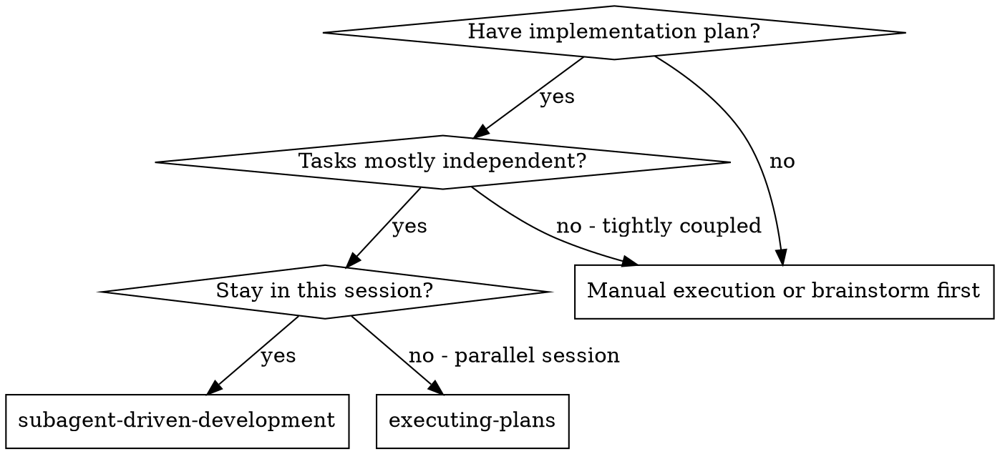
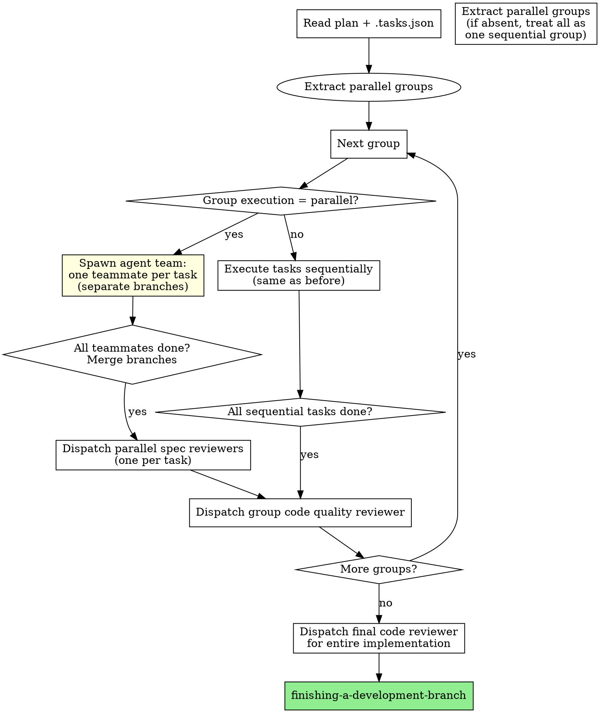
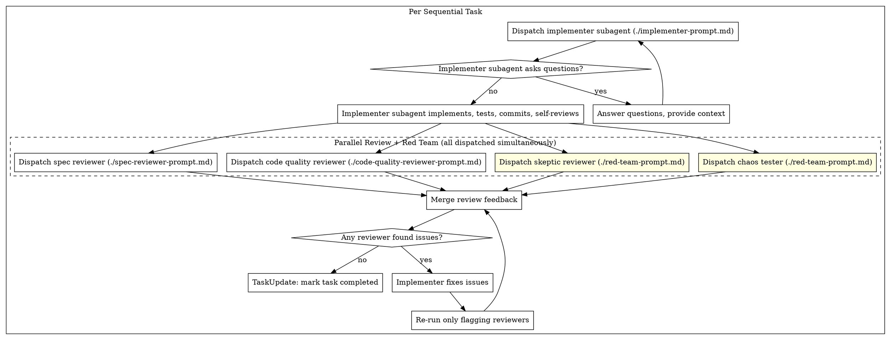

# Subagent-Driven Development

Execute plan by dispatching fresh subagent per task, with parallel review after each: spec compliance and code quality reviewers dispatched simultaneously. Independent tasks run concurrently as agent teammates.

**Core principle:** Fresh subagent per task + parallel review (spec and quality simultaneously) + parallel execution of independent tasks = high quality, fast iteration

## When to Use



**vs. Executing Plans (parallel session):**
- Same session (no context switch)
- Fresh subagent per task (no context pollution)
- Parallel review after each task: spec compliance and code quality simultaneously
- Faster iteration (no human-in-loop between tasks)

## The Process

### Execution Model: Groups → Tasks

The plan's `.tasks.json` defines **parallel groups**. The controller processes groups in order:



### Sequential Task Flow

For tasks in sequential groups, the original per-task flow applies:



**Parallel review:** Spec reviewer and code quality reviewer are dispatched **simultaneously** in a single message. Their feedback is merged, and the implementer addresses all issues at once. Only reviewers that flagged issues re-run after fixes. This cuts review time roughly in half for passing tasks.

**Rationale:** The previous sequential order (spec first, then quality) was motivated by "can't quality-review code that doesn't meet spec." In practice, both reviewers read code independently — running them in parallel and merging feedback is safe.

**Red team agents:** Alongside spec and code quality reviewers, two adversarial agents are dispatched in parallel:

- **Skeptic Reviewer** — questions whether the change actually solves the stated problem and whether tests prove what they claim. Uses `./red-team-prompt.md` (Mode: Skeptic Reviewer).
- **Chaos Tester** — writes adversarial tests targeting boundary conditions, type coercion, state corruption, contract violations, and resource exhaustion. Uses `./red-team-prompt.md` (Mode: Chaos Tester).

All four reviewers dispatch in a **single message** for maximum concurrency. Their feedback is merged together. Critical red team concerns must be addressed; minor concerns are optional.

**Red team dispatch template:**
```
# All in ONE message — 4 parallel reviewers
Agent tool: "Review spec compliance for Task N"
  prompt: [spec-reviewer-prompt.md filled]

Agent tool: "Review code quality for Task N"
  prompt: [code-quality-reviewer-prompt.md filled]

Agent tool: "Red team: skeptic review Task N"
  prompt: [red-team-prompt.md skeptic mode filled]

Agent tool: "Red team: chaos test Task N"
  prompt: [red-team-prompt.md chaos tester mode filled]
```

### Parallel Group Execution

For groups marked `"execution": "parallel"`, spawn an **agent team**:

**Maximum group size: 5 teammates.** Beyond this, coordination overhead and API rate limits outweigh parallelism gains. If a parallel group has more than 5 tasks, split it into sub-groups of 3-5.

#### Step 1: Verify file independence

Before spawning, check that `filesTouched` arrays across tasks in the group have zero overlap. Also check for common shared files that plan authors miss: barrel exports (`index.ts`, `__init__.py`), config files (`package.json`, `pyproject.toml`), shared test fixtures (`conftest.py`). If any overlap is detected, **fall back to sequential execution** and warn the user.

#### Step 2: Record group start

Sync `.tasks.json`: set all tasks in the group to `"in_progress"` with current timestamp. This ensures that if the session crashes, a resumed session can see these tasks were started (not still `"pending"`).

#### Step 3: Spawn teammates on separate branches

Dispatch one Agent per task, all in a **single message** (this makes them concurrent). Each teammate uses `./teammate-prompt.md` — creates its own git branch (`task-N-<name>`), implements, tests, commits to that branch, and self-reviews.

```
# All in ONE message for concurrency — each teammate creates its own branch
Agent tool:
  description: "Implement Task 2: User API"
  prompt: [teammate-prompt.md filled with Task 2]

Agent tool:
  description: "Implement Task 3: Product API"
  prompt: [teammate-prompt.md filled with Task 3]

Agent tool:
  description: "Implement Task 4: Search service"
  prompt: [teammate-prompt.md filled with Task 4]
```

#### Step 4: Merge teammate branches

After all teammates complete, the controller merges each task branch into the feature branch:

```bash
git checkout <feature-branch>
git merge task-2-user-api --no-ff -m "Merge Task 2: User API"
git merge task-3-product-api --no-ff -m "Merge Task 3: Product API"
git merge task-4-search-service --no-ff -m "Merge Task 4: Search service"
```

If a merge conflicts, **stop and report to the user** — do not force-resolve. Conflicts mean the `filesTouched` declarations were incomplete.

If a teammate failed (returned an error or incomplete work), skip its branch merge and mark its task as `"failed"` in `.tasks.json`. The remaining tasks can still proceed.

#### Step 5: Spec compliance review (independent, parallel)

Dispatch one spec reviewer per task, all in a **single message** for concurrency. Each uses `./spec-reviewer-prompt.md` scoped to that task's commits:

Additionally, dispatch one skeptic reviewer per task in the same message (using `./red-team-prompt.md` Mode: Skeptic Reviewer). And dispatch one chaos tester per task (using `./red-team-prompt.md` Mode: Chaos Tester). All reviewers for all tasks dispatch in a single message for maximum concurrency.

```
# Parallel spec reviews — one per task, all concurrent
Agent tool:
  description: "Review spec compliance for Task 2"
  prompt: [spec-reviewer-prompt.md with Task 2's spec and diff]

Agent tool:
  description: "Review spec compliance for Task 3"
  prompt: [spec-reviewer-prompt.md with Task 3's spec and diff]

Agent tool:
  description: "Review spec compliance for Task 4"
  prompt: [spec-reviewer-prompt.md with Task 4's spec and diff]
```

If any spec review fails, dispatch a fix subagent for that task, then re-run its spec review.

#### Step 6: Group code quality review

After all spec reviews pass, dispatch a single code quality reviewer for the group's combined diff (from the commit before the group started to HEAD).

#### Step 7: Sync completion

Mark all tasks as `"completed"` in `.tasks.json`. Clean up task branches:

```bash
git branch -d task-2-user-api task-3-product-api task-4-search-service
```

## Prompt Templates

- `./implementer-prompt.md` - Dispatch implementer subagent (sequential tasks)
- `./teammate-prompt.md` - Dispatch parallel teammate agent (parallel groups)
- `./spec-reviewer-prompt.md` - Dispatch spec compliance reviewer subagent
- `./code-quality-reviewer-prompt.md` - Dispatch code quality reviewer subagent
- `./red-team-prompt.md` - Dispatch red team agents (skeptic reviewer + chaos tester)

## Example Workflow

```
You: I'm using Subagent-Driven Development to execute this plan.

[Read plan file + .tasks.json]
[Extract parallel groups and all tasks]
[TaskCreate for each task with full description]

=== Group 1 (sequential): Foundation ===

Task 1: Database schema + shared types

[Dispatch implementation subagent with full task text + context]
Implementer: Implemented schema, 3/3 tests passing, committed.

[Dispatch spec compliance reviewer]
Spec reviewer: ✅ Spec compliant

[Dispatch code quality reviewer]
Code reviewer: ✅ Approved

[Mark Task 1 complete, sync .tasks.json]

=== Group 2 (parallel): Independent Features ===

[Verify file independence: Tasks 2, 3, 4 have zero file overlap ✅]
[Check shared files: no barrel exports or configs affected ✅]
[Sync .tasks.json: set Tasks 2, 3, 4 to "in_progress"]
[Spawn 3 teammates concurrently in a single message]

Teammate A (Task 2: User API):
  - Branch: task-2-user-api
  - Implemented user endpoints, 5/5 tests passing
  - Files: src/users.py, tests/test_users.py (within ownership ✅)
  - Self-review: Clean, follows patterns
  - Committed to task-2-user-api branch

Teammate B (Task 3: Product API):
  - Branch: task-3-product-api
  - Implemented product endpoints, 4/4 tests passing
  - Files: src/products.py, tests/test_products.py (within ownership ✅)
  - Self-review: Clean, follows patterns
  - Committed to task-3-product-api branch

Teammate C (Task 4: Search service):
  - Branch: task-4-search-service
  - Implemented search, 6/6 tests passing
  - Files: src/search.py, tests/test_search.py (within ownership ✅)
  - Self-review: Clean, follows patterns
  - Committed to task-4-search-service branch

[All 3 completed concurrently — wall time = slowest teammate, not sum]

[Merge branches sequentially into feature branch]
git merge task-2-user-api --no-ff ✅
git merge task-3-product-api --no-ff ✅
git merge task-4-search-service --no-ff ✅

[Dispatch 3 parallel spec reviewers — one per task]
Spec reviewer (Task 2): ✅ Spec compliant
Spec reviewer (Task 3): ✅ Spec compliant
Spec reviewer (Task 4): ✅ Spec compliant

[Dispatch group code quality reviewer for combined diff]
Group reviewer: Strengths: Clean separation. Issues: None. Approved.

[Mark Tasks 2, 3, 4 complete, sync .tasks.json]
[Clean up branches: git branch -d task-2-* task-3-* task-4-*]

=== Group 3 (sequential): Integration ===

Task 5: Integration tests + wiring

[Dispatch implementation subagent]
...standard sequential flow...

[After all groups]
[Dispatch final code-reviewer for entire implementation]
Final reviewer: All requirements met, ready to merge

Done!
```

## Advantages

**vs. Manual execution:**
- Subagents follow TDD naturally
- Fresh context per task (no confusion)
- Parallel-safe (subagents don't interfere)
- Subagent can ask questions (before AND during work)

**vs. Executing Plans:**
- Same session (no handoff)
- Continuous progress (no waiting)
- Review checkpoints automatic

**Efficiency gains:**
- No file reading overhead (controller provides full text)
- Controller curates exactly what context is needed
- Subagent gets complete information upfront
- Questions surfaced before work begins (not after)

**Quality gates:**
- Self-review catches issues before handoff
- Parallel review: spec compliance and code quality simultaneously
- Review loops ensure fixes actually work
- Spec compliance prevents over/under-building
- Code quality ensures implementation is well-built

**Cost:**
- More subagent invocations (implementer + 2 reviewers per task)
- Controller does more prep work (extracting all tasks upfront)
- Review loops add iterations
- But catches issues early (cheaper than debugging later)

## Red Flags

**Never:**
- Start implementation on main/master branch without explicit user consent
- Skip reviews (spec compliance OR code quality)
- Proceed with unfixed issues
- Parallelize tasks that share files (check `filesTouched` — any overlap = sequential)
- Parallelize tasks without verifying file independence first
- Make subagent read plan file (provide full text instead)
- Skip scene-setting context (subagent needs to understand where task fits)
- Ignore subagent questions (answer before letting them proceed)
- Accept "close enough" on spec compliance (spec reviewer found issues = not done)
- Skip review loops (reviewer found issues = implementer fixes = review again)
- Let implementer self-review replace actual review (both are needed)
- **Ignore review feedback from any reviewer** (all parallel reviewers' feedback is merged and addressed together)
- Move to next task while either review has open issues

**If subagent asks questions:**
- Answer clearly and completely
- Provide additional context if needed
- Don't rush them into implementation

**If reviewer finds issues:**
- Implementer (same subagent) fixes them
- Reviewer reviews again
- Repeat until approved
- Don't skip the re-review

**If subagent fails task:**
- Dispatch fix subagent with specific instructions
- Don't try to fix manually (context pollution)

## Task Persistence Sync

Update `.tasks.json` at every status transition, not just on completion:

1. Read `<plan-path>.tasks.json`
2. Set the task's `"status"` to the new status (`"in_progress"`, `"completed"`, or `"failed"`)
3. Set `"lastUpdated"` to current ISO timestamp
4. Write the file back

**Valid status values:** `"pending"`, `"in_progress"`, `"completed"`, `"failed"`

**For parallel groups:** Set all group tasks to `"in_progress"` BEFORE spawning teammates. This ensures that if the session crashes mid-group, a resumed session sees `"in_progress"` (not `"pending"`) and can check git history for committed branches before re-dispatching.

**Cross-session resume with parallel groups:** If `.tasks.json` shows tasks as `"in_progress"`, the resumed session should:
1. Check for task branches (`git branch --list 'task-*'`) to identify completed work
2. Merge any completed task branches that haven't been merged yet
3. Re-dispatch only tasks with no committed branch

## Integration

**Required workflow skills:**
- **superpowers-extended-cc:using-git-worktrees** - REQUIRED: Set up isolated workspace before starting
- **superpowers-extended-cc:writing-plans** - Creates the plan this skill executes
- **superpowers-extended-cc:requesting-code-review** - Code review template for reviewer subagents
- **superpowers-extended-cc:finishing-a-development-branch** - Complete development after all tasks

**Subagents should use:**
- **superpowers-extended-cc:test-driven-development** - Subagents follow TDD for each task

**Alternative workflow:**
- **superpowers-extended-cc:executing-plans** - Use for parallel session instead of same-session execution
